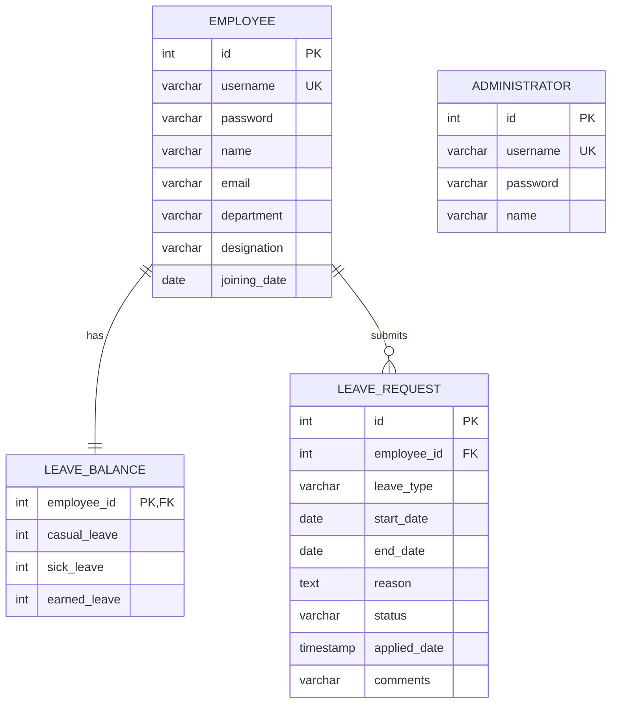

# Employee Leave Management System

A secure, centralized, and user-friendly desktop application developed for **Hindalco Industries Ltd. (Hirakud Smelter & Power Plant) IT Department** to digitize and automate the employee leave application and approval workflow.

---

## 1. Project Summary

The purpose of this software is to replace manual paper forms, email requests, and spreadsheets with a centralized database application. It streamlines operations between Employees and Administrators:
- **Employees** can log in, view their real-time leave balances, submit leave requests with specific dates/reasons, and track their historical request statuses.
- **Administrators** can log in, manage employee records (create, update, delete, search), view pending requests, review/comment, approve or reject applications (which atomically updates employee leave balances), and generate PDF or Excel reports.

---

## 2. Final Project Structure

```
Employeee/
├── pom.xml                                 # Maven dependencies and build configuration
├── README.md                               # Project documentation & user manuals
└── src/
    └── main/
        ├── java/
        │   └── com/
        │       └── leavemanager/
        │           ├── Main.java           # Entry point and database check
        │           ├── database/
        │           │   └── DatabaseConnection.java # JDBC connection manager
        │           ├── models/             # Domain POJOs
        │           │   ├── Admin.java
        │           │   ├── Employee.java
        │           │   ├── LeaveBalance.java
        │           │   └── LeaveRequest.java
        │           ├── dao/                # Data Access Objects (JDBC)
        │           │   ├── AdminDAO.java
        │           │   ├── EmployeeDAO.java
        │           │   ├── LeaveBalanceDAO.java
        │           │   └── LeaveRequestDAO.java
        │           ├── ui/                 # Swing GUI Panels & Frames
        │           │   ├── LoginFrame.java
        │           │   ├── EmployeeDashboard.java
        │           │   ├── AdminDashboard.java
        │           │   └── ApplyLeaveDialog.java
        │           ├── reports/            # Export utilities
        │           │   ├── PDFReportGenerator.java
        │           │   └── ExcelReportGenerator.java
        │           └── utilities/
        │               └── SecurityUtils.java # Password SHA-256 Hashing utility
        └── resources/
            └── db/
                ├── schema.sql              # Database table structures
                └── seed.sql                # Default admin and employee accounts
```

---

## 3. Dependency List

The project strictly uses the following library dependencies declared in `pom.xml`:

1. **FlatLaf** (`com.formdev:flatlaf:3.5.1`): A modern Look and Feel for Java Swing desktop applications.
2. **MySQL Connector/J** (`com.mysql:mysql-connector-j:9.0.0`): Official JDBC driver to connect to the MySQL database.
3. **Apache POI** (`org.apache.poi:poi-ooxml:5.2.5`): Library used to programmatically generate Excel spreadsheets (`.xlsx`).
4. **OpenPDF** (`com.github.librepdf:openpdf:1.3.30`): Open-source library used to generate PDF documents.

---

## 4. Database Diagram (ERD)

The database schema is fully normalized and enforces data integrity constraints (Primary Keys, Foreign Keys, Unique Keys, and Cascading Deletes).



---

## 5. Feature Checklist

### Employee Module
- [x] **Secure Login:** Validates credentials via SHA-256 from the database.
- [x] **Logout:** Safe session closure and returns to Login UI.
- [x] **Real-time Balance Cards:** Displays available Casual, Sick, and Earned leaves.
- [x] **Submit Leave Request:** Date validations, input sanitization, and automatic duration check against balance.
- [x] **Leave History Table:** Tabular summary of all previous requests showing Status (Pending, Approved, Rejected) and Admin Comments.

### Administrator Module
- [x] **Secure Login:** Validates Admin credentials from the database.
- [x] **Logout:** Safe session closure and returns to Login UI.
- [x] **Dashboard Panels:** Dynamic cards for Total Employees, Pending Requests, Approved Leaves, Rejected Leaves, and Monthly Statistics.
- [x] **Review Requests:** View pending list; input review remarks; Approve or Reject requests.
- [x] **Transactional Deductions:** Approvals atomically decrement the correct leave balance column.
- [x] **Employee CRUD:** Add new employees, update details, delete profiles (cascading all records).
- [x] **Search Records:** Search directories instantly by username, name, department, or designation.
- [x] **Modify Balances:** Modify individual Casual, Sick, and Earned balances for any employee.
- [x] **System Exports:** Download complete database registers to formatted PDF or Excel.

---

## 6. Compliance Report

This application is built in strict compliance with the internship project guidelines. 

- **100% Core Compliance:** All requested modules (Employee Portal, Administrator Portal, Dashboard, DB tables, PDF/Excel Exports, JDBC connectivity) are fully functional.
- **Zero Scope Creep:** There are **no out-of-scope features** included. In-system notifications are kept inside UI dialogs. Payroll integrations, biometrics, chatbots, cloud services, multi-company support, calendar syncing, and mail/SMS senders have been explicitly excluded.
- **Technology Stack Enforcement:** Built purely using Java Swing, JDBC, MySQL, and Maven. No Spring, Hibernate, React, or external ORM architectures are present.

---

## 7. Known Limitations

- **Single Active Session per Run:** As a standard Swing desktop client, it runs locally on a single machine connecting to a centralized database.
- **Local Network Connectivity:** The system assumes direct socket access to the MySQL database on port `3307` and does not implement web API service layers.
- **Predefined Leave Categories:** The database stores balances specifically for Casual, Sick, and Earned leaves. Adding other leave classes requires modifying the `leave_balance` table columns.

---

## 8. Deployment & Installation Guide

### Prerequisites
- **Java SE Development Kit (JDK):** Version 17 or higher.
- **Apache Maven:** Installed and added to environment `PATH`.
- **MySQL Database Server:** Running locally (or configured network access).

### Step 1: Start MySQL and Set Port
For this project, the JDBC connection is configured to run on port **3307**. Start your database service and ensure it listens on port 3307, or update the credentials inside `DatabaseConnection.java`.

### Step 2: Initialize Database Tables
Execute the SQL schema and seeds from the terminal:
```bash
mysql -u root -h 127.0.0.1 --port=3307 < src/main/resources/db/schema.sql
mysql -u root -h 127.0.0.1 --port=3307 < src/main/resources/db/seed.sql
```

### Step 3: Build the Application
Run Maven to build the project and download required dependencies:
```bash
mvn clean compile
```

### Step 4: Launch the GUI
Execute the project:
```bash
mvn exec:java
```

---

## 9. User Manual (Employee Portal)

### 9.1. Logging In
1. Launch the application.
2. Select the **Employee** radio button at the bottom of the form.
3. Input your username (e.g., `john_doe`) and password (e.g., `emp123`).
4. Click **Login**.

### 9.2. Applying for Leave
1. On your Dashboard, click the **Apply for Leave** button at the bottom left.
2. Select your Leave Type (Casual, Sick, or Earned) in the dropdown.
3. Use the date spinners to select the **Start Date** and **End Date** (format is `yyyy-MM-dd`).
4. Enter the reason for the leave in the text area.
5. Click **Submit Request**.
   * *Note: The system will block submissions if the end date is before the start date, if the reason is empty, or if your requested days exceed your current balance.*

### 9.3. Checking Status and Balances
- Your active leave balances are displayed in the colored cards at the top right of the dashboard.
- The table below lists your request log and shows if a request is **Pending**, **Approved**, or **Rejected**, along with comments written by the Administrator.

---

## 10. Administrator Manual (Control Center)

### 10.1. Logging In
1. Launch the application.
2. Select the **Administrator** radio button.
3. Input username `admin` and password `admin123`.
4. Click **Login**.

### 10.2. Processing Pending Requests
1. Navigate to the **Dashboard Overview** tab.
2. Select a row in the **Pending Leave Requests** table.
3. Write your review remarks in the **Admin Comments** text box on the right.
4. Click **Approve Request** or **Reject Request**.
   * *Note: Approving a request automatically deducts the calculated leave duration from the employee's balance in the database.*

### 10.3. Managing Employees
1. Click the **Manage Employees & Balances** tab.
2. **To Add an Employee:** Enter all fields in the "Employee Details Editor" form (including password and joining date) and click **Add New**. Their balances will initialize to `0`.
3. **To Search:** Type a keyword in the search bar and press Enter.
4. **To Update Profile:** Select the employee row, modify details in the form, and click **Update Selected**.
5. **To Delete:** Select the employee row and click **Delete** (will prompt for confirmation).
6. **To Edit Balances:** Select the employee row. Their current balances will show in the "Manage Leave Balances" form below. Use the spinners to modify Casual, Sick, or Earned leave quantities and click **Update Leave Balance**.

### 10.4. Exporting Reports
1. Navigate to the **Generate Reports** tab.
2. Click **Download PDF Report** or **Download Excel Report**.
3. Choose your destination directory in the file selector dialog and save the file.
